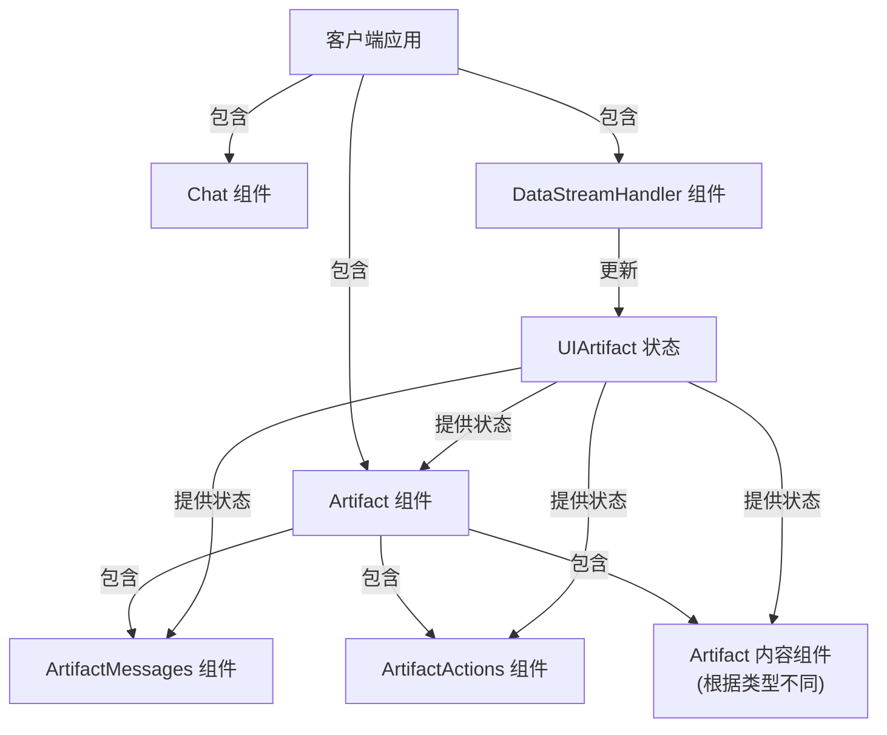
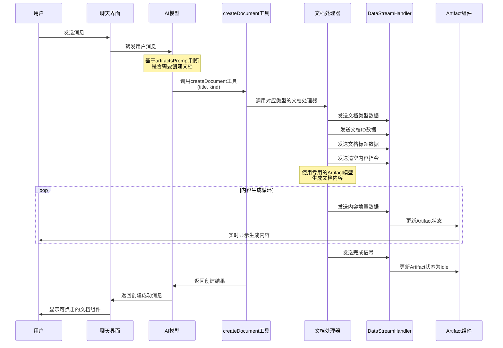
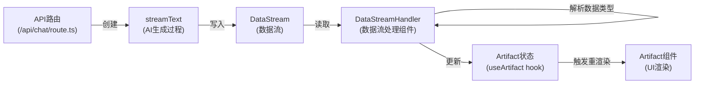
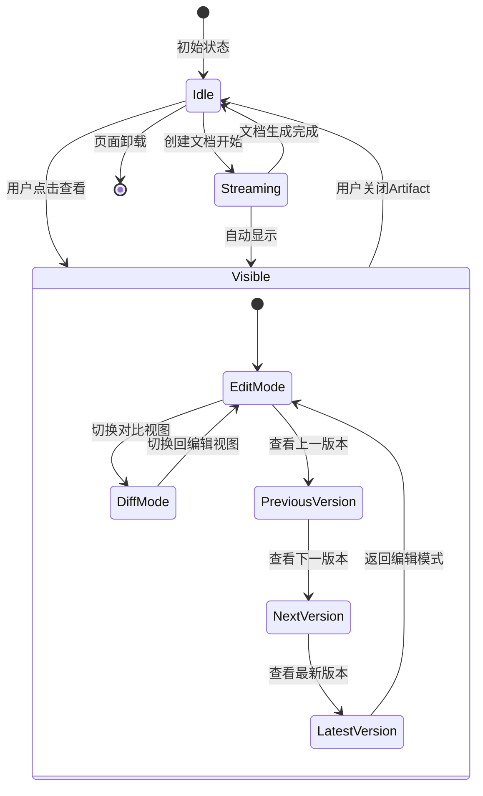
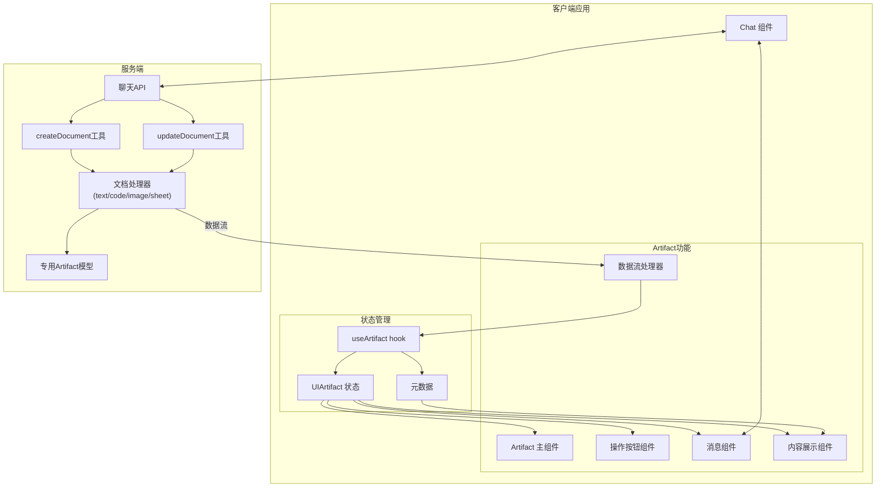
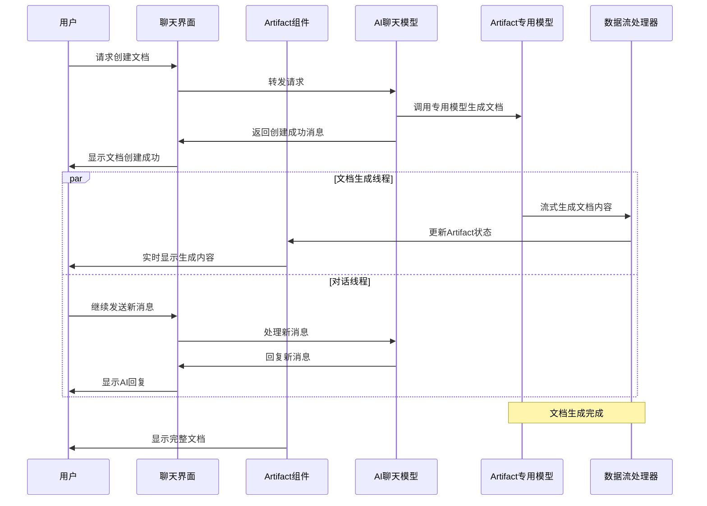
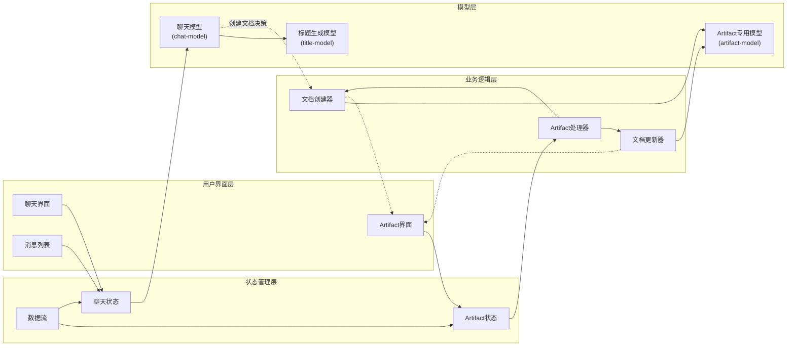
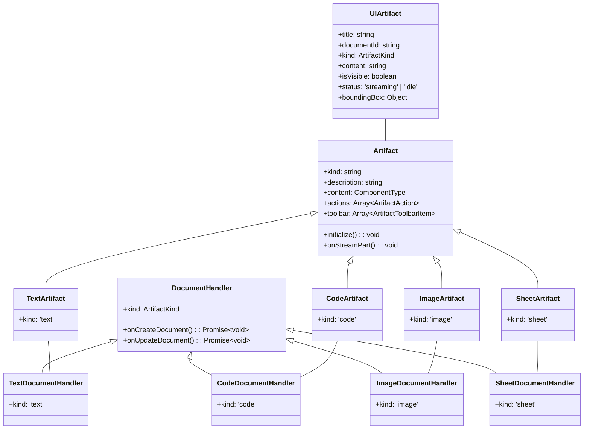

# Artifact 实现流程图解

本文档通过多种流程图展示 Artifact 功能的实现过程、组件关系和数据流动。

## 1. Artifact 组件架构图

## 2. Artifact 创建流程图

## 3. 数据流处理图

## 4. Artifact 状态管理图

## 5. 组件交互关系图

## 6. 并行对话与文档生成流程

## 7. Artifact 系统与模型关系图

## 8. Artifact 类型与处理器关系图

上述流程图展示了 Artifact 系统的各个方面，包括:

1. 组件架构和层次关系
2. 创建流程和数据流动
3. 状态管理和状态转换
4. 组件之间的交互关系
5. 并行处理机制
6. 系统与模型的关系
7. Artifact 类型与处理器的关系

这些图表共同描绘了 Artifact 功能的完整实现逻辑和技术架构。 